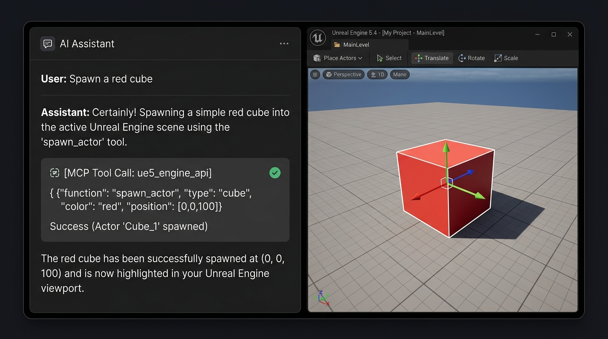
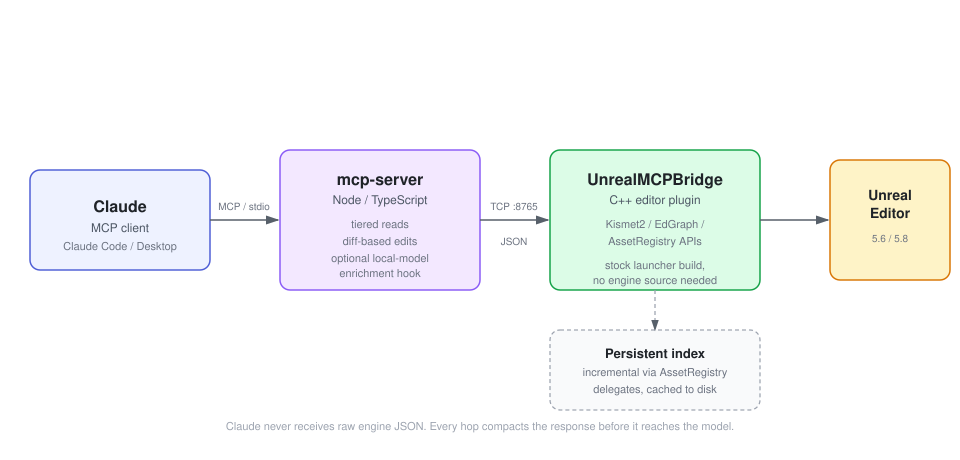

# unreal-mcp



An MCP server that allows AI agents (Claude, Cursor) to directly control and manipulate Unreal Engine.

This server lets Claude (or any MCP client) read and edit Unreal Engine 5.6/5.8 Blueprints directly, without burning your context window on raw engine JSON, and without needing anything beyond a stock Epic Games Launcher install.



## The problem this solves

If you've tried pointing an AI assistant at a real Unreal project, you've hit this: Blueprints don't fit in a context window. A single graph dumped as raw engine data is enormous, so either the model never sees enough of the project to have real context, or you spend most of your budget re-explaining what already exists every time you open a new conversation.

This project is built around one idea: **the model should never receive a raw engine dump.** Every hop between the Unreal Editor and Claude compacts the data: tiered reads, diff-based edits, and a persistent index that's built once and updated incrementally instead of re-scanned on every question.

## How it works

Two pieces:

- **`UnrealMCPBridge`** is a C++ editor plugin that runs inside `UnrealEditor.exe` and exposes a local TCP interface over the engine's own Kismet2/EdGraph/AssetRegistry APIs. Built against a stock launcher install: no engine source required to build or run it.
- **`mcp-server`** is a Node/TypeScript MCP server that translates MCP tool calls into bridge requests, and is responsible for keeping every response cheap: compact field names, capped result sizes, and no re-serializing verbose engine data verbatim.

See [ARCHITECTURE.md](ARCHITECTURE.md) for the full design.

## What it can do

101 tools, grouped by the job rather than by the API they call. Every one is exercised against a real
~1,000-Blueprint project, not a fixture.

**Understand a project you did not write**
`get_project_overview`, `search_project`, `find_references`, `map_system`, `explain_graph`,
`list_blueprints`, `read_blueprint_summary`, `read_node_detail`, `describe_class`, `find_source`,
`trace_variable`, `trace_function_calls`, `list_actors`, `read_class_defaults`, `undo_history`.
Ask for "the countdown" and get the system back - the Blueprints, the functions, what calls what,
ordered for reading - rather than a list of string matches.

**Find bugs, in plain English**
`audit_project`, `review_blueprint`, `project_health`, `find_orphans`, `check_data_tables`,
`read_runtime_errors`, `doctor`. The audit prices every finding, so what surfaces first is what
actually costs you: a missing `Parent: BeginPlay`, a replicated variable whose `OnRep_` is empty, a
Data Table row pointing at a deleted asset, an event graph nothing reaches.

**Build features, and prove they work**
`plan_feature`, `scaffold_blueprint`, `scaffold_widget`, `build_graph`, `add_node`, `connect_pins`,
`add_event_handler`, `create_function`, `add_variable`, `set_variable_replication`,
`auto_layout_graph`, `cleanup_blueprint`, `compile_blueprint`, `verify_feature`. Graphs come out laid
out and commented, because output that compiles and output someone is happy to inherit are different
things.

**Whatever the work happens to be made of**
Blueprints, C++ (`find_source`, `compile_cpp`, `hot_reload_cpp`), Data Tables, Data Assets, structs,
enums, materials and instances, UMG widgets, input mappings, levels and actors, Animation Blueprints,
Behavior Trees, Niagara. Read support is deliberately wider than write support, and the README says
which is which for each.

**Watch it actually run**
`start_pie`, `watch_runtime`, `pie_status`, `screenshot`, `run_console_command`, `stop_pie`. Every
other read here says what a Blueprint *claims* it does. These say what it *did* - including the one
class of bug a single person cannot reproduce alone:

```text
Authority: 0 -> 490  changed=true
Client0:   0 -> 0    changed=false      <- the variable is not replicated
```

## Added in the last day

115 commits. The parts worth knowing about:

- **`watch_runtime` - observe a running game.** Samples variables on live actors during play, in every
  PIE world, labelled by net role. Proven by planting a replication bug in a real project, watching
  only the server's copy move, fixing it, and watching both move.
- **`hot_reload_cpp` - the Ctrl+Alt+F11 a human presses.** Until this, a model could find a native
  bug, write the fix and prove it compiled - and the change sat on disk, because the running editor
  holds the DLL. Applying it meant *you* closing the editor. Now it is one call.
- **`run_console_command` - the tilde key.** `ce StartWave` to fire an event nothing calls yet,
  `Ke * ResetHealth` to call a function on every instance, `stat unit`, `slomo`, cvars, cheats. One
  definition instead of forty, and it reports `recognised: false` for a typo rather than letting a
  misspelled command look like a working one that did nothing.
- **Reads got cheaper again, measured.** Against the same 809-node graph: `explain_graph` 3,671 ->
  **2,329**, `get_project_overview` 1,698 -> **829**, and `find_references` and `list_blueprints` both
  compacted as well. The whole plant-find-fix-prove loop is 9 calls and **~1,544 tokens**, which
  `npm run trial:diagnose` runs against a live editor rather than asserting. Two further compactions
  were measured and **reverted** - one saved 38 tokens and broke how you naturally identify an actor.
- **Dead-graph detection.** A liveness fixpoint over the whole project, biased toward calling things
  live: 52 of 511 graphs nothing reaches, in the project it was validated against. `map_system` and
  `plan_feature` now say out loud that a system matching your search may be the replaced one, because
  extending something nothing calls produces a feature that cannot run.
- **New reads: Animation Blueprints, Behavior Trees, Niagara, Data Assets.** "The enemies are not
  following" and "the effect does not play" are real sentences people say, and none of them had
  anything to land on.
- **A failure class named and hunted down.** *A check reporting "I found no problems" and "I could not
  look" with the same word.* Four instances fixed - the doctor claiming an all-clear on a plugin that
  was missing two commands, `find_orphans` saying "clean" when the class name matched nothing,
  `check_data_tables` saying "clean" when a column was empty in every row, and a preset missing the
  one tool its own job starts from.
- **The tests were mutation-tested.** 444 tests, all with assertions - but *has assertions* is not
  *can fail*. Twelve deliberate mutations; eleven caught, one not. That one led to a real defect: a
  check name that drifts or was never priced silently scores 1 and sinks under every cosmetic finding.
- **A feature built and then deleted.** A `SpawnActor` node the tool's own instructions had claimed
  for months. It crashed the editor four times; the whole thing was reverted and the README now says
  plainly that it is not buildable this way. A claim that is not true is worse than a missing feature.

## What's different about this one

There are several Unreal MCP projects on GitHub already, and as of UE 5.8 Epic ships its own experimental first-party MCP plugin (5.8 only, opt-in). Worth being direct about where this project actually differs, rather than just claiming "better":

- **Built around reading, not just writing.** Most existing projects are strong at creating and manipulating Blueprints from a prompt, but don't address what happens when the model needs to *understand a large, already-built* project first. Reading is the first-class citizen here: tiered summaries before full detail, node IDs you can reference without re-fetching.
- **A persistent, incrementally-updated project index.** The bridge indexes Blueprints, functions, variables, and cross-asset references once, caches it to disk, and updates it from `AssetRegistry` delegates as you edit, instead of rescanning the project on every query. `find_references` answers "what actually uses this Blueprint" without the model having to enumerate the project itself.
- **Reads that fit in a context window.** Reading one real Blueprint graph — 807 nodes — used to
  return **126,477 tokens**, 63% of a 200k window in a single call, from a project whose whole premise
  is that the model never sees a raw engine dump. It is **3,110** now, with the full graph one
  parameter away and a `match` filter that answers a specific question for a fraction of that. Every
  read is measured against a real project by `npm run measure:reads`, which finds the worst graph
  itself and fails the build if any read grows past its ceiling.
- **A tool surface that costs 2.4k tokens instead of 34.8k.** Tool definitions are paid for on *every* request, before your message is read. The `search` profile stands up four tools and switches the other 97 off — and because they are switched off rather than hidden behind a generic dispatcher, `unreal_enable_tools` hands back their **real, fully typed schemas**. One extra call at the start of a session, nothing given up, and 32k tokens a turn saved for the rest of it. The numbers are measured by `npm run check:profiles`, which fails the build if a profile grows past its budget.
- **The server tells the model how to work before it starts.** MCP's `instructions` field carries the call order and the exact strings no model can recall reliably — the target pin is `self`, Sequence's outputs are `then_0`/`then_1` — so the model arrives knowing them instead of spending failed calls discovering them. `unreal_guide` then lets it look anything else up mid-task, a section at a time.
- **It can see the game run, not just read the files.** `watch_runtime` samples variables on live actors during play, in every PIE world, labelled by net role. Replication bugs are the one class of defect a single person cannot reproduce alone — `Authority: 0 -> 490, Client0: 0 -> 0` is that bug observed rather than argued. No other project in the survey reads runtime state at all.
- **It can finish a C++ change, not just check one.** `compile_cpp` proves an edit builds; `hot_reload_cpp` patches it into the editor that is already open, which is the Ctrl+Alt+F11 a human presses. Without it, every native fix ends with a human closing the editor.
- **Findings are priced, so the important one is first.** The audit scores every finding by what it actually costs you, and every check name is guarded by a test — an unpriced name silently scored 1 and sank below every cosmetic result, which was found by mutation-testing the suite rather than by reading it.
- **Verdicts distinguish "nothing is wrong" from "I could not look".** They used to share a word, in four places. A tool that says `clean` when it could not check is worse than one that says nothing.
- **Targets both 5.6 and 5.8 from one codebase**, where several existing projects are pinned to a single engine version.

Small local models are still supported and still measured — the `minimal` profile exists because a 14B on a 12 GB card loads at 8k context and fails at 16k — but they are now an explicit opt-in rather than what the install path quietly hands everyone. There is also an optional local-model hook for indexing (`UNREAL_MCP_LOCAL_LLM_URL`), which generates search summaries off your context budget. Fully optional; the index works without it.

Full survey of the existing ecosystem (licenses, architectures, what each one does well) is in [docs/COMPETITIVE_LANDSCAPE.md](docs/COMPETITIVE_LANDSCAPE.md).

There is also a companion document that starts from the other end: [docs/COMPLAINTS_SOLVED.md](docs/COMPLAINTS_SOLVED.md) collects the complaints people actually file about Unreal MCP servers, each with its source link, and states plainly whether this project solves it, partly solves it, or does not. The open rows are left open on purpose.

## Status

This is being built and verified in public, milestone by milestone. Each milestone's status doc is written honestly, including what's compiled/tested versus what's still unverified:

- [Milestone 1: read-only Blueprint introspection](docs/M1_STATUS.md): compiles and runs against a real UE 5.8 install; MCP protocol verified end-to-end.
- [Milestone 2: create/edit Blueprint graphs](docs/M2_STATUS.md): create Blueprints, add nodes, connect pins, add variables, compile with structured error reporting.
- [Milestone 3: persistent project index, search, references](docs/M3_STATUS.md): incrementally-updated index (AssetRegistry-backed, disk-cached), `search_project`, `find_references`, `get_project_overview`, optional local-model enrichment for search results.
- [Milestone 4: UE 5.6 support](docs/UE56_STATUS.md): live-verified on 5.6, 21 of 21 checks passing, and released. The plugin source needs zero changes between the two engine versions.
- [Milestone 5: node/function ground-truth catalog](docs/M5_STATUS.md): `unreal_find_node` and `unreal_get_node_signature`, reading the running engine's real Blueprint-callable surface via reflection (12,402 functions on 5.6, 15,775 on 5.8, built in ~0.1s). `unreal_add_node` now answers a wrong function name with `didYouMean` near-misses instead of a dead end.

All four milestones are build-verified, protocol-verified, **and live-verified on both engine
versions**. See [docs/LIVE_VERIFICATION.md](docs/LIVE_VERIFICATION.md) for the 5.8 session against a
real ~20-Blueprint project and [docs/UE56_STATUS.md](docs/UE56_STATUS.md) for the 5.6 one: reads
returning correct real data, a full create/wire/compile/save write round-trip, and confirmation that
the incremental project index actually stays fresh without restarting the editor (M3's core claim).

Both live sessions earned their keep by catching a real bug that no amount of compiling or protocol
testing would have surfaced. On 5.8 it was `add_node` duplicating an already-present override-event
node. On 5.6 it was the `.uplugin` hard-pinning `EngineVersion` to `5.8.0`: every build check passed
because UnrealBuildTool ignores that field, but the runtime plugin loader honors it, so the editor
stopped on a modal incompatibility dialog and the bridge never started.

Since then, all of that has been exercised live too: `remove_node` and `VariableGet` are covered by
the node-id and control-flow suites, and `add_node` now places `Branch`, `Sequence`, `Cast`, and
standard-library macros (`ForEachLoop`, `WhileLoop`, ...) directly, verified by building and
compiling a real conditional graph through the bridge alone. Node ids are persistent GUIDs, and
every write is undoable with Ctrl+Z under a named "MCP:" transaction. Still outstanding:
`CustomEvent`/`VariableSet` node types have not had a dedicated live check, and the M5 catalog
covers `UFunction`-backed nodes; native `UK2Node` types are placed via the dedicated `nodeType`
values rather than discovered through `unreal_find_node`.

## Quickstart (4-Step Installation)

Ensure you have **Node.js 18+** and a **UE 5.6 / 5.8** project.

### 1. Install the Unreal Plugin

Copy the `UnrealMCPBridge` plugin folder into your Unreal project's `Plugins/` directory:

```bash
# macOS / Linux
mkdir -p "/path/to/YourProject/Plugins" && cp -r UnrealMCPBridge "/path/to/YourProject/Plugins/"

# Windows (PowerShell)
New-Item -ItemType Directory -Force -Path "C:\path\to\YourProject\Plugins"; Copy-Item -Recurse UnrealMCPBridge "C:\path\to\YourProject\Plugins\"
```
*Note: Rebuild/open your Unreal project to compile the plugin, and ensure it is enabled in the editor.*

There are prebuilt plugin releases on the releases page, and they are **older than this server**.
The bridge has gained more than twenty commands since the last one, and the protocol number did not
change, so an old plugin looks healthy and then fails on the first tool that needs a command it does
not have. `--doctor` now probes for those commands specifically and says so. Building from this
checkout is the reliable path.

### 2. Build the MCP Server
Install the node dependencies and compile the typescript codebase:

```bash
cd mcp-server && npm install && npm run build
```

### 3. Check it works before wiring anything up

With the editor open, run:

```bash
node mcp-server/dist/index.js --doctor
```

It reports whether the plugin is reachable, whether its protocol matches the server, whether the
project index is built or still scanning, whether the engine's node catalog is readable, and
whether a PIE session is in the way. Every failed check comes with the remedy, so you never have
to guess which of six things is wrong. Exit code 1 means the editor could not be reached.

### 4. Register the Server

**Do not hand-write the config.** Run this and paste what it prints:

```bash
node mcp-server/dist/index.js --print-config                      # Claude Desktop
node mcp-server/dist/index.js --print-config --client cursor      # Cursor
node mcp-server/dist/index.js --print-config --client claude-code # Claude Code
```

It emits the exact JSON for this machine, with absolute paths already resolved, and tells you which
file it goes in.

That exists because client setup is its own category of failure and all of it is self-inflicted: a
missing comma breaks the whole file, a relative path silently does not resolve, and on Windows a
bare `node` may not be on the PATH the client uses. Every one of those produces the same symptom —
the server never starts, with no explanation. The printed config uses the absolute path of the Node
that ran the command, so it cannot be the wrong one.

Then **fully quit and reopen the client.** Closing the window is not enough, and it is the most
common reason a correct config appears not to work.

<details>
<summary>Writing the config by hand (only if the command above cannot run)</summary>

Point your client at the absolute path of `mcp-server/dist/index.js`:

**Claude Code:**
```bash
claude mcp add unreal -- node "/path/to/unreal-mcp/mcp-server/dist/index.js"
```

**Claude Desktop** (`claude_desktop_config.json`):
```json
{
  "mcpServers": {
    "unreal": {
      "command": "node",
      "args": ["/path/to/unreal-mcp/mcp-server/dist/index.js"]
    }
  }
}
```

Note that `"command": "node"` depends on `node` being on the PATH your client uses, which on Windows
it often is not. That is the single most common reason a correct-looking config never starts, and
the reason `--print-config` exists.

</details>

Once registered, open your project in the Unreal Editor and verify the connection via `unreal_ping`.

For more configuration options and details, see [`mcp-server/README.md`](mcp-server/README.md).


## What CI covers, and what it does not

**Status: the workflow is committed but has never run.** GitHub refused to start it - *"the job was
not started because your account is locked due to a billing issue"* - so no badge is shown here. A
badge reading "failing" for a billing reason would say something false about the code. The workflow
is structurally valid and the whole suite is verified to pass locally with no editor running, which
is the same thing it does on a runner; that is a claim about local runs, not a CI result.

The badge above covers the parts that need no Unreal install, run on a clean Linux machine with
nothing preinstalled: build, typecheck, tool/bridge parity, documentation guards, profile token
budgets, strict-client protocol conformance, and the unit tests - on the oldest Node the README
promises and on the current one. It also checks that `--doctor` and `--print-config` behave
correctly with **no editor running**, since that is exactly when someone reaches for them.

It does **not** run live verification or the local-model benchmark. Those need a running editor, and
one needs a GPU. Their results live in [docs/LIVE_VERIFICATION.md](docs/LIVE_VERIFICATION.md) and
[docs/LOCAL_MODEL_BENCHMARK.md](docs/LOCAL_MODEL_BENCHMARK.md), and they are run by hand against both
engine versions. Claiming them in CI would make the badge mean less than it does.

The C++ plugin is not compiled in CI either, because Epic does not ship an engine that can be
fetched there. `npm run build:engines` builds it against every configured engine locally and reports
success only if every one of them actually built.

## Contributing

Issues and PRs welcome. This project is young and moving fast, so check the status docs above before assuming something works end-to-end.

## License

MIT. See [LICENSE](LICENSE).

