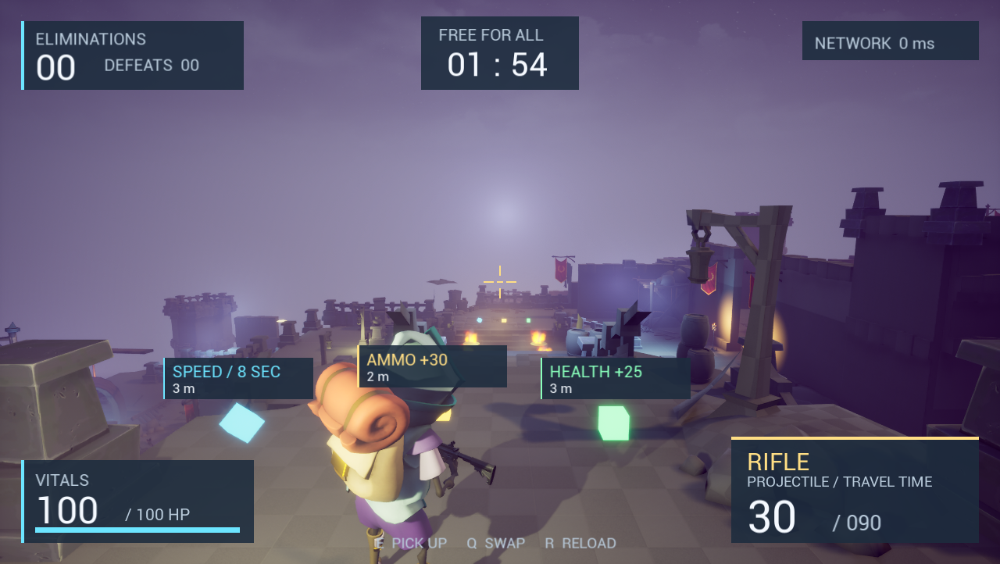

# Blaster — UE5.6 多人射击原型

基于多人射击课程进行的 UE5.6.1 项目实践，采用 C++ 权威玩法、蓝图资产配置和动画表现。已有 Listen Server +1 Client PIE 证据；这是学习与作品集原型，正式美术和独立发布验收仍有后续项。



## 当前功能

- Projectile / Hitscan / Shotgun 三种服务器权威命中模型。
- 连发、弹匣与携带弹药、手动/自动换弹、瞄准FOV、准星。
- 生命、淘汰、重生、得分与死亡次数；10秒准备 /120秒比赛 /10秒结算后重启。
- 默认武器、主副武器切换、掉落与重拾；生命、弹药、限时加速拾取。
- Hitscan 历史命中回溯，身体/爆头伤害；非法时间、重复序号、错误武器与非拥有者请求验证。
- 最新击杀公告、领先者/平分显示、高延迟提示（运行与视觉验证边界见矩阵）。

## 本机启动

引擎：`E:\programs\Epic Games\UE_5.6`；项目：`E:\work\unreal_projects\Blaster`。

```powershell
& 'E:\programs\Epic Games\UE_5.6\Engine\Build\BatchFiles\Build.bat' BlasterEditor Win64 Development 'E:\work\unreal_projects\Blaster\Blaster.uproject' -WaitMutex -NoHotReloadFromIDE -NoUBA -MaxParallelActions=1
```

完整构建前正常退出Editor，避免DLL占用。打开项目后使用Lobby地图，PIE设置2名玩家、Play As Listen Server。大厅到达两人后进入BlasterMap。无需在测试中登录外部服务；这不等于Steam跨机器连接已验证。

本机DX12曾出现GPU device hung。当前验证使用启动参数 `-d3d11 -ExecCmds="t.MaxFPS 30"`；没有修改默认渲染设置，也没有证明DX12问题已解决。

GameDefaultMap已修正到项目的MapStartUp，实际菜单含Host/Join/Quit。原配置备份在`Saved/ConfigBackups/DefaultEngine-before-startup-20260908.ini`。菜单显示已验证，不代表外部Steam会话创建/加入已通过。

操作：WASD移动，鼠标瞄准，左键射击，右键精瞄，E拾取，R换弹，Q切换主副武器。跳跃/蹲下沿用现有输入配置。

## 交付资料

- [最新射击、准星、出生与拾取体验修订](docs/PRESENTATION-REVISION.md)

- [验证矩阵与限制](docs/VERIFICATION.md)
- [架构与网络数据流](docs/ARCHITECTURE.md)
- [3–5分钟演示脚本](docs/DEMO.md)
- [简历表述与面试题](docs/PORTFOLIO.md)
- [SSR实现与扩展设计](learn/networking/B09-hitscan-rewind.md)
- [Teams / CTF后续设计](learn/networking/B11-teams-ctf-design.md)
- [学习知识库](learn/README.md)

## 归属与复现边界

这是课程衍生学习项目，不宣称原创整套游戏设计。用户已有项目、资产和Editor配置是基础；本轮C++功能、部分Editor脚本配置、测试与文档由AI协作完成。不能据此宣称用户已独立掌握全部实现。

`Content/`当前被Git忽略，源代码仓库本身不足以复现：必须保留本机已保存的Content资产及其合法来源。不要直接发布第三方素材。没有执行提交、推送或发布操作。
