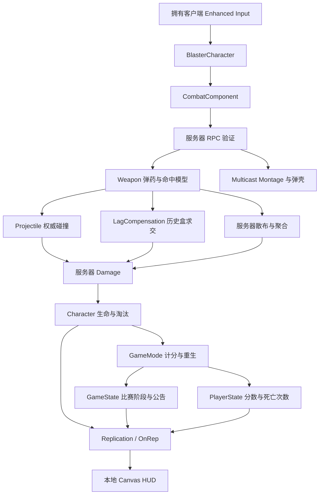

# 架构与网络数据流

| 对象 | 所有权与职责 |
| --- | --- |
| Character | 拥有者输入；服务器生命/淘汰/移动增益；骨骼动画与相机 |
| CombatComponent | 角色拥有客户端可以请求RPC；服务器验证射速、时间、弹药、换弹、装备 |
| Weapon | 复制弹药、物理/拾取状态；服务器决定归属 |
| Projectile | 服务器碰撞伤害；客户端轨迹表现 |
| LagCompensation | 仅服务器存历史，不复制历史包，不移动真实角色 |
| GameMode | 仅服务器存在，控制比赛状态、生成、重生与计分 |
| GameState | 给所有客户端恢复当前阶段、结束时刻与短时公告 |
| PlayerState | 计分跨Pawn重生保存，每轮清零 |
| HUD | 每帧读当前Pawn与State，不结算玩法 |
| Pickup | 仅服务器响应重叠、消费一次、30秒后重新激活 |

## 生命周期

淘汰时先设置不可重复结算标志，再计分并掉落双武器，3秒后替换Pawn。新Pawn获得默认武器；原PlayerState保留比分。Combat/Character EndPlay清理各自计时器。掉落武器60秒生命周期，重新拾起取消销毁计时。速度增益结束恢复600；淘汰清计时器，新Pawn不继承增益。

客户端Fire表现目前等待服务器Multicast，没有本地预测；因此高延迟下反馈有延迟，但没有预测与服务器重复播放的双重路径。弹药也未做预测。这里是明确实现边界。
