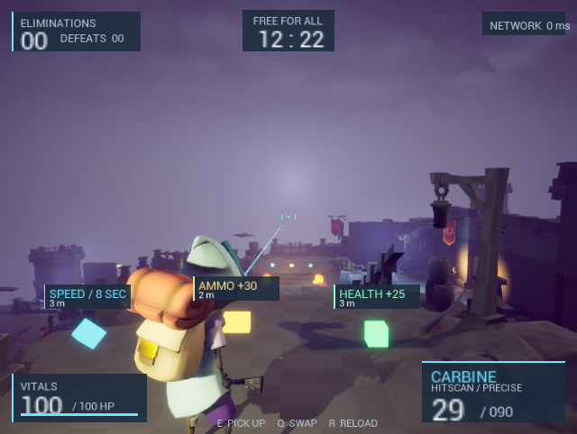
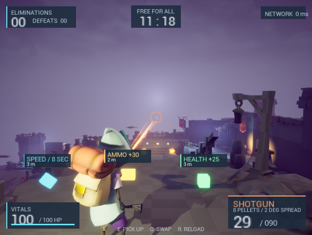

# 射击、出生和拾取体验调整

本轮依据用户实机反馈调整，保留服务器权威伤害、弹药与射速规则。

| 枪械 | 准星 | 射击表现 | 面板说明 |
| --- | --- | --- | --- |
| Rifle | 金色紧凑十字 | 移动子弹的金色曳光 | Travel time |
| Carbine | 青色中心点与两侧定位线 | 青色瞬时射线 | Instant hit |
| Shotgun | 橙色散布圈 | 服务器实际八条pellet方向 | 8 pellets / 2 degree spread |

霰弹枪圈按2度半角与当前FOV换算屏幕半径，瞄准放大时同步变化。近距离枪口与相机视差仍存在，圈表示角度范围，不承诺每颗弹丸落在圆周。

发光效果使用真正的无碰撞Mesh和Unlit材质，替代短DebugLine；寿命约0.065–0.16秒，仅本地表现、不复制效果Actor、不产生额外伤害。Projectile仍按10000cm/s移动。Hitscan落点闪光是表面反馈，不作为服务器确认伤害标记。

## 地图

BlasterMap新增4个带DistributedSpawn标签的PlayerStart，经过地面Trace和角色胶囊检查。GameMode在合法点中选择距离其他存活玩家最远的位置，重生重新选择，不沿用缓存StartSpot。四人PIE实际最小间距18.8米，四端位置一致，重生生命100且位置合法。

四个区域使用带Loot_*标签的TargetPoint配置枪械/补给。位置保存在地图中，编辑时可移动，不再把所有物品写死在同一平台。生命/弹药/速度使用绿色方块、金色弹药块、青色菱形，HUD显示名称、距离和近距离拾取提示。隐藏/已持有物品不显示标签；距离上限12米、最多6个、不穿墙、避免标签互相遮盖。

## HUD

顶部左侧比分、中间回合时间、右侧网络状态；底部左侧生命、右侧武器与大号弹药；中央保留战斗视野。低生命/空弹使用警示色。背景面板提高地图明暗变化下的对比度，布局按视口尺寸缩放。

旧地图备份：Saved/RevisionBackups/BlasterMap-before-distributed-spawns.umap。资产被Git忽略，需要与源代码一同保留。测试比赛时长已恢复并保存为120秒。

## 验证

- Editor与Game目标均构建成功；最终简短文案版本分别2.77秒和7.17秒。
- 四人分散出生及重生验证通过，最小距离18.8米。
- 最终13把可拾取枪械（12把新增布点、1把原有）和12个补给在两端一致。
- 轻微右肩视角来自保存的原生默认值，不依赖测试传送或临时镜头修改。
- 卡宾枪青色射线、霰弹枪八条服务器弹道已截图；开火扣弹与特效清理已验证。
- 霰弹枪ADS的FOV60、散布圈19.36像素（640宽），标签隐藏；普通FOV90约11.17像素。
- 新位置弹药拾取90→120；已持有枪械和消耗补给不再显示拾取标签。
- 640×482、1280×722实机布局检查；字体改用Slate运行时字形，避免位图拉伸。

范围仍是原型级表现：无新增正式音效或独立枪械模型；所有伤害/弹药权威规则保留。地图超过4名玩家时可能复用出生区域，当前4人验证不代表任意人数保证最小距离。

## 实机截图

清晰字体与布局（截图后仅缩短了少量提示文案，避免小窗口溢出）：

弹道验证截图（拍摄于最后一次字体修正之前）：

2026-09-08 后续修订：枪械弹匣、射速与后座力现已独立配置，当前数值和验证见 [WEAPON-HANDLING.md](WEAPON-HANDLING.md)。
