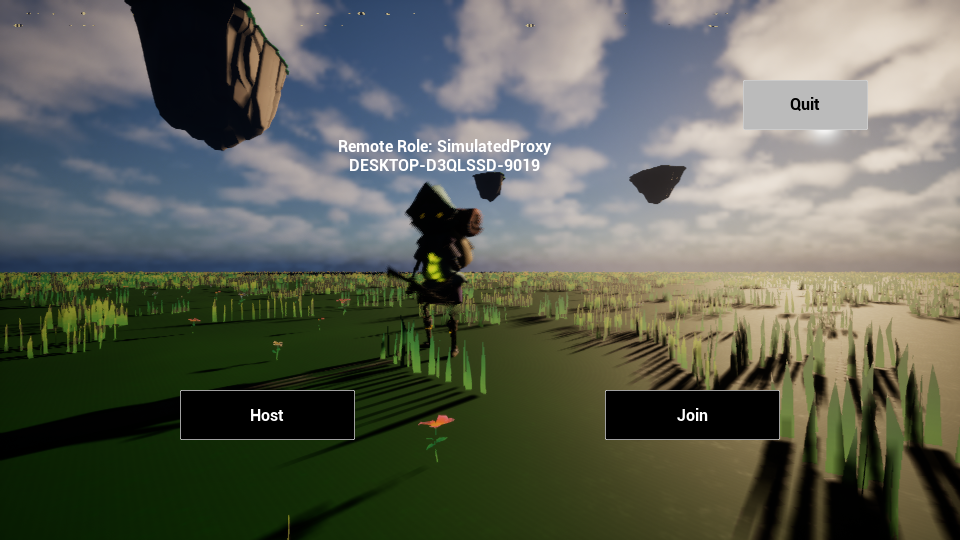

# 验证矩阵（2026-09-08）

后续用户体验修订已加入四区域出生/拾取、差异化准星与曳光、右肩视角和新的HUD。最新证据见[体验修订](PRESENTATION-REVISION.md)。下表B03准星数值是修订前的历史测试，当前准星按枪械模型区分。

环境：UE5.6.1、Windows、本机 Listen Server +1 Client。以下数值来自实际PIE与完整Editor构建；不是独立服务器、跨机器Steam或打包测试。

最新构建：BlasterEditor Win64 Development 14.79秒成功；Blaster Win64 Development 71.58秒成功，生成Binaries/Win64/Blaster.exe。后者是Game编译产物，未Cook/Stage，不能视为可直接分发的完整游戏包。

独立启动：使用UnrealEditor.exe的`-game -nosteam -d3d11`，不传地图参数，实际加载保存配置中的MapStartUp，初始化6.17秒，960×540截图显示Host/Join/Quit。日志未匹配Error/Fatal。它证明默认启动路径可用，不替代Cook/Stage后的可执行程序验收。

| 包 | 证据 | 状态/边界 |
| --- | --- | --- |
| B01 动画/IK | 左右转向两端触发，移动打断，持枪IK有效 | 原型动画；正式美术未打磨 |
| B02 射击 | 3秒20枪、15秒100枪；同帧20请求仅1；松手与销毁清理 | 已PIE；表现服务器确认后播放 |
| B03 瞄准HUD | FOV90→60→90；准星静止7/瞄准2/移动19/空中23；Shot实际玩家截图显示完整HUD | 已PIE和玩家截图检查 |
| B04 生命重生 | 100→80；3秒重生100；重复死亡不重复计分；客户端伤害无效 | 已PIE |
| B05 弹药换弹 | R从0/90→30/60；换弹中不能开火，死亡不转移弹药；10秒持枪57发、剩3/60；自然耗尽120发后重复输入仍0/0且不换弹 | 手动/自动与无备弹失败路径已PIE |
| B06 比赛 | 自然10/120/10循环；两端时钟最大差0.040秒；结算拒绝伤害/射击；2分/2死亡跨轮两端清零 | 已PIE；独立晚加入尚未验证 |
| B07 三模型 | Hitscan20；Shotgun8×4聚合32；墙体阻挡 | 已PIE；无爆炸武器实例 |
| B08 双武器 | Q交换保留弹药；第三把掉落；死亡掉双枪；重生默认30 | 已PIE |
| B08 拾取 | 生命50→75→100满值不消费；弹药90→180；速度900→600；30秒返回 | 已PIE |
| B09 SSR | 历史横移命中、当前旧射线未中；身体20/头40；错误请求与非拥有者拒绝 | 已PIE；粗盒和当前世界遮挡限制 |
| B09 延迟 | Net PktLag=100，实测153ms；客户端实际两枪100→60 | 已PIE；延迟关闭、比赛120秒已恢复保存 |
| B10 公告/领先/Ping | 完整构建14.79秒；公告两端一致且5秒到期；重复死者伤害不刷新期限；领先者实际玩家截图可见 | 已PIE核心链路；Ping告警视觉与离开菜单扩展未验收 |
| B11 Teams/CTF | 完整设计与验收矩阵 | 明确未实现，按原计划Optional裁剪 |
| B12 交付 | README、架构、矩阵、演示与面试材料；独立游戏模式干净启动菜单 | 核心原型交付；视频录制与独立打包为后续 |

## 已知限制

- 默认DX12曾GPU device hung；本轮恢复后使用DX11+30fps。未证明渲染故障根因或修复。
- Content被Git忽略。资产已保存在本机，但仅克隆代码不能复现。
- Steam公网/双机器、专用服务器、断线重连、打包版本未验收；PIE成功不替代它们。
- 正式音效、粒子、淘汰动画/溶解、换弹动画、背部副武器模型、王冠未实现；部分武器复用同一外观。
- 三命中模型之外的火箭爆炸/手雷/狙击镜、Shotgun逐发换弹、Projectile/Shotgun SSR、预测弹药均为后续。
- 最新公告只保留一条，短时间多次淘汰会覆盖，不是完整击杀日志。
- 当前地图通过PlayerStart和带Loot标签的TargetPoint配置出生/物品位置，四个区域经过验证；暂未提供动态随机补给生成系统。
- 构建有现存MSVC非首选版本与MCP插件依赖声明警告；不得称为零警告。
- Game构建另有现存Engine/VRM4U弃用API警告；未为了消除警告修改第三方插件。

详细过程保存在 `.agents/worklog.md`；独立完成、AI协作、Editor配置与未验证状态以实际证据区分。

## 保留截图

第一张为实际玩家视口，第二张为独立游戏模式第一帧附近的截图（光照/抗锯齿尚未完全收敛）。均非设计稿。
